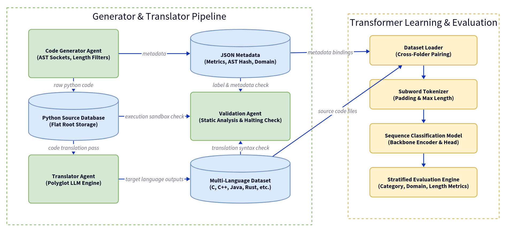

# TermBench2



**TermBench: Agentic Synthesis of a Multi-Language Benchmark for Neural Termination Analysis**

TermBench is a comprehensive, polyglot dataset and multi-agent synthesis pipeline designed for training and evaluating neural models on the Halting Problem. It provides 33,000 algorithmic programs translated across 11 programming languages, strictly balanced by termination label, algorithmic category, and structural complexity. 

This repository contains the multi-agent framework used to generate the data, the full evaluation pipeline, and the resulting TermBench dataset as presented at FSE '27.

---

## 📊 Dataset Overview

Evaluating neural estimators of program termination requires data with reliable labels, controlled structure, and limited contamination from LLM pre-training corpora. TermBench addresses this by using an agent-driven pipeline with AST-skeleton deduplication, execution-based validation, and strict compilation checks.

*   **Total Size:** 33,000 programs (3,000 unique algorithmic seeds × 11 languages).
*   **Labels:** Exactly 1:1 ratio of Terminating to Non-Terminating (Infinite) programs.
*   **Languages:** C, C++, Java, JavaScript, PHP, Python, R, Ruby, Rust, Swift, and TypeScript.
*   **Algorithmic Categories:** 
    *   Boundary Conditions
    *   Data Mutations
    *   Floating-Point Precision
    *   Mathematical Sequences
    *   Recursion
*   **Lengths:** Evenly distributed across Short (<15 lines), Medium (15–30 lines), and Long (>30 lines) logic configurations.

---

## 📂 Repository Structure

```text
.
├── dataset/                 # The core TermBench corpus, organized by language
│   ├── c/                   
│   ├── cpp/                 
│   ├── java/                
│   ├── javascript/
│   ├── php/
│   ├── python/
│   ├── r/
│   ├── ruby/
│   ├── rust/
│   ├── swift/
│   └── typescript/
├── evaluations/             # Fine-tuning and evaluation scripts for transformer-based encoders
├── imgs/                    # Figures, architecture diagrams, and plots used in the paper
├── llm_compare/             # Evaluation harness for zero-shot frontier LLMs
├── llm_compare_results/     # Raw metrics and outputs from frontier LLM evaluations
├── results/                 # Metrics from the fine-tuned encoder baselines
└── tools/                   # The Multi-Agent Synthesis Pipeline (Generator, Translator, Verifier)